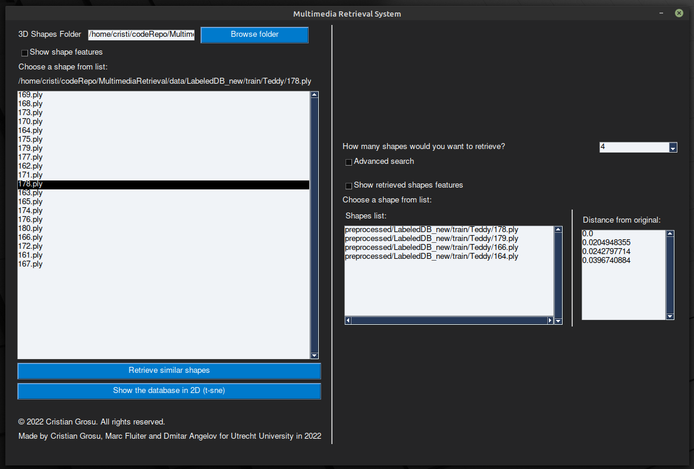
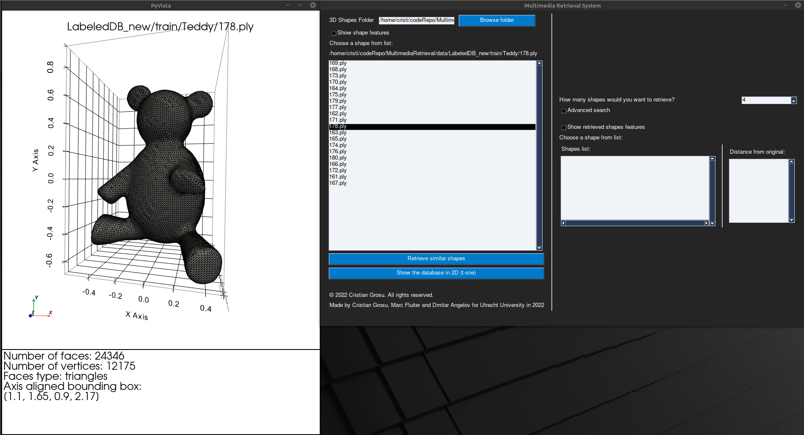
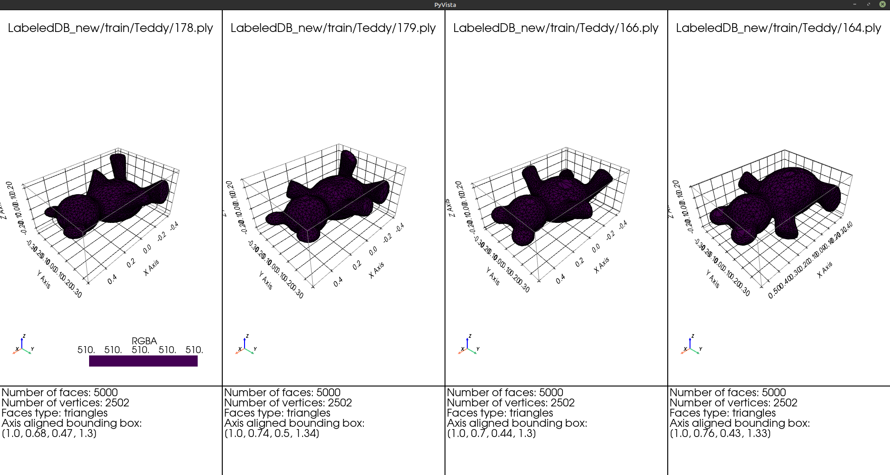
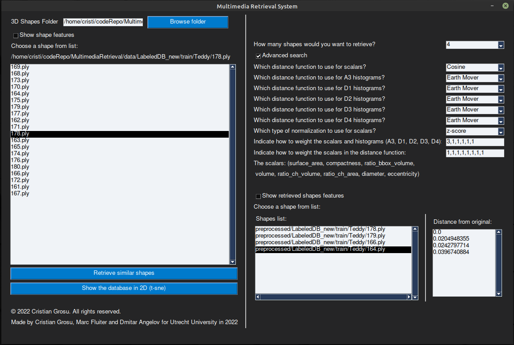

<!--
 Copyright 2022 Cristian Grosu
 
 Licensed under the Apache License, Version 2.0 (the "License");
 you may not use this file except in compliance with the License.
 You may obtain a copy of the License at
 
     http://www.apache.org/licenses/LICENSE-2.0
 
 Unless required by applicable law or agreed to in writing, software
 distributed under the License is distributed on an "AS IS" BASIS,
 WITHOUT WARRANTIES OR CONDITIONS OF ANY KIND, either express or implied.
 See the License for the specific language governing permissions and
 limitations under the License.
-->

# Multimedia Retrieval System

## :scroll: Description

A multimedia retrieval system for 3D shapes. Project for Utrecht University :university: in 2022 done by Grosu Cristian :moldova:, Angelov Dmitar :bulgaria: and Fluiter Marc :netherlands: , all rights reserved :copyright:.

## :rocket: Quick start

In order to run the application follow the next 2 simple steps:

1) In order to get the project started first run the following command: `pip install -r requirements.txt`
2) Now you can run `python3 main.py` to start the application

Or simply run the following command `./main.sh` which will install the dependencies and start the GUI for you

Enjoy :rocket: !

## :book: Usage Guide

After starting the programm you a window should open as follows:

In order to select the 3D shape you want to query browse for the directory in which you have the shape of insterest and select it from that directory.
After selecting a window with an overview of the shape you selected is opened as follows:

Close this window and press the <b> Retrieve similar shapes </b> button.
The system will display a window with most similar shapes as follows:

After closing the results overview window in the system window a list of filenames and distances of the most similar found shapes is displayed
Click on a filename to view the 3D shape

### :blue_book: Advanced search

If you want to manually ajust the distance function check the <b> Advanced search </b> checkbox.
A menu with the options is displayed as follows:

Change the options you desire and press the  <b> Retrieve similar shapes </b> button to get the most similar shapes with the new distance function.

Enjoy our 3D retrieval system :rocket: !

## :books: Details

For the technical report please follow this link `https://www.overleaf.com/1781678451tvmkmtkhcrbg` or see the `report` folder in this project
The source code could also be find at the following link `https://github.com/cristi2019255/MultimediaRetrieval`

## :cloud: Cloud databasee

The extracted features are stored in a :cloud: database. Please be informed that we are sharing a database connection via the
`.env` file, the database have some limitations we set in order to prevent abuses from future users. The database will become unavailable in 2023.

Database dashboard in Hekoru: `https://data.heroku.com/datastores/fd3a9a51-2a81-42fd-8891-093915414ce3#`
See `.env` for more details.

##### :sunny: Final message

Support Ukraine :ukraine: ! (2022)
